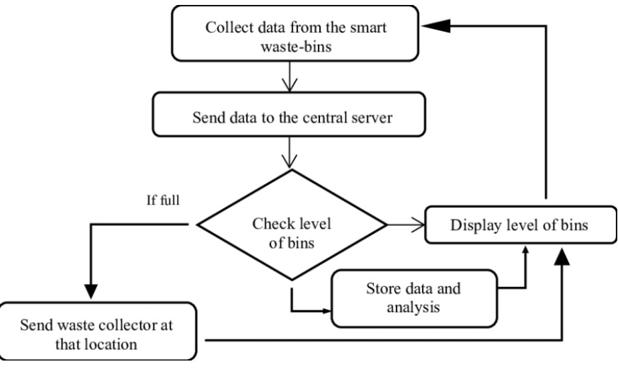
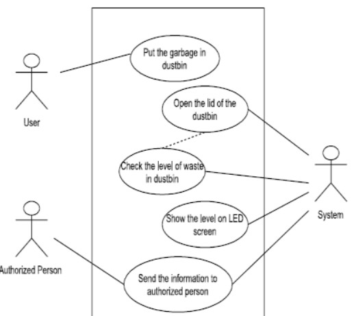

# Smart India Hackathon Workshop
# Date: 17.05.2024
## Register Number: 212223110027
## Name: MERCY A
## Problem Title
E-Waste Facility Locator
## Problem Description
Website that tells you the location of the nearest e-waste collection and recycling facility. Offers educational pop-ups on the harmful components of your e-waste and their effects on the environment and human health if not disposed correctly. There could be an option to input the model of your old device and earn credit points relative to the amount of precious metals recovered from the device if disposed correctly.
## Problem Creater's Organization
Ministry of Environment

## Idea

By providing a user-friendly interface and a searchable database of e-waste recycling facilities, the locator makes it easy for individuals and businesses to find convenient disposal options.The locator raises awareness about the importance of proper e-waste disposal and educates users about the environmental and health risks associated with improper disposal.By promoting recycling and proper disposal of e-waste, the locator helps reduce the amount of electronic waste ending up in landfills and incinerators, conserving resources and minimizing pollution.E-waste recycling facilities can recover valuable materials like gold, silver, and copper from electronic devices, reducing the need for raw materials and energy-intensive mining processes.By facilitating compliance with e-waste recycling regulations and guidelines, the locator helps businesses and individuals fulfill their legal obligations regarding e-waste disposal.

## Proposed Solution / Architecture Diagram

## Use Cases

## Technology Stack
- Frameworks
    - React.js
    - Angular
    - Vue.js
  - UI Components
    - Material-UI
    - Bootstrap
  - Mapping
    - Leaflet.js
    - Google Maps API

## Dependencies

#### Development Dependencies:
front-end and back-end,Database Management System

#### Development Tools:
Code Editors, Version Control System

#### Budjet for project:
60,000-85,000

#### Time period:
20days-1month

